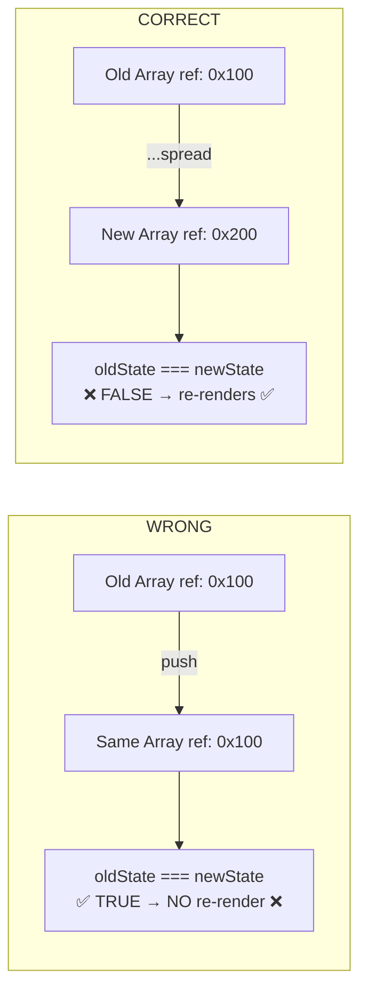

Optimized tool selectionLet me answer each part of your question:

## Why do we need to create a **new** array instead of mutating the old one?

React uses **reference equality** (`===`) to detect state changes. When you call `setItems(...)`, React internally compares the old value with the new one:

```tsx
// React's internal check is something like:
oldState === newState  // If TRUE → skip re-render
```

If you mutate the same array (e.g., `items.push(newItem)`), the **reference doesn't change**, so `oldState === newState` is still `true`, and React **won't re-render**. You must create a **brand new array reference** for React to detect the change.



---

## What does `...` (Spread Operator) do?

The spread operator `...` "unpacks" all elements from an existing array/object into a new one:

```tsx
const fruits = ['apple', 'banana'];
const newFruits = [...fruits, 'cherry'];
//                      ↑ unpacks 'apple', 'banana'
// Result: ['apple', 'banana', 'cherry'] — a completely new array!

// Same with objects:
const user = { name: 'Alice', age: 25 };
const updated = { ...user, age: 26 };
//                  ↑ unpacks name, age
// Result: { name: 'Alice', age: 26 } — new object reference!
```

Without `...`, you'd have to do this manually:
```tsx
// Without spread (tedious):
const newFruits = [fruits[0], fruits[1], 'cherry'];

// With spread (clean):
const newFruits = [...fruits, 'cherry'];
```

---

## Examples of Updating Items in an Array

Here are all common array update patterns in React:

```tsx
const [items, setItems] = useState([
  { id: 1, text: 'Buy milk', done: false },
  { id: 2, text: 'Walk dog', done: false },
  { id: 3, text: 'Read book', done: true },
]);

// 1️⃣ ADD an item → spread old + new
const add = (newItem) => {
  setItems(prev => [...prev, newItem]);
};

// 2️⃣ REMOVE an item → filter out the one you don't want
const remove = (id) => {
  setItems(prev => prev.filter(item => item.id !== id));
};

// 3️⃣ UPDATE a specific item → map and replace the matching one
const toggleDone = (id) => {
  setItems(prev => prev.map(item =>
    item.id === id
      ? { ...item, done: !item.done }  // new object for changed item
      : item                            // keep unchanged items as-is
  ));
};

// 4️⃣ INSERT at a specific position → slice + spread
const insertAt = (index, newItem) => {
  setItems(prev => [
    ...prev.slice(0, index),  // everything before
    newItem,                   // new item
    ...prev.slice(index)       // everything after
  ]);
};

// 5️⃣ REPLACE entire array
const clearAll = () => {
  setItems([]); // brand new empty array
};
```

---

## Examples of ALL Important Rules

### Rule 1: Never mutate state directly ❌

```tsx
// ❌ WRONG — mutates the same array reference
items.push('new');        // no re-render!
items[0] = 'changed';     // no re-render!
user.name = 'Bob';        // no re-render!

// ✅ CORRECT — creates new references
setItems(prev => [...prev, 'new']);
setItems(prev => prev.map((item, i) => i === 0 ? 'changed' : item));
setUser(prev => ({ ...prev, name: 'Bob' }));
```

### Rule 2: State updates are asynchronous ⚠️

```tsx
// ❌ WRONG — count hasn't changed yet on the next line
setCount(count + 1);
console.log(count); // still the OLD value!

// ✅ CORRECT — use useEffect if you need the updated value
useEffect(() => {
  console.log(count); // fires AFTER render with NEW value
}, [count]);
```

### Rule 3: Use functional updates when new state depends on old 🔄

```tsx
// ❌ RISKY — all three use the same "stale" count value
setCount(count + 1); // count = 0 → 1
setCount(count + 1); // count = 0 → 1 (same!)
setCount(count + 1); // count = 0 → 1 (same!)
// Result: count = 1, not 3!

// ✅ CORRECT — each receives the latest value
setCount(prev => prev + 1); // prev = 0 → 1 // rerender
setCount(prev => prev + 1); // prev = 1 → 2 // rerender
setCount(prev => prev + 1); // prev = 2 → 3 // rerender
// Result: count = 3 ✅
```

### Rule 4: Objects & arrays need new references 🆕

```tsx
// ❌ WRONG — same object reference
user.age = 30;
setUser(user); // React sees: oldUser === newUser → no re-render

// ✅ CORRECT — new object via spread
setUser(prev => ({ ...prev, age: 30 }));

// Same for nested objects:
const [state, setState] = useState({ user: { name: 'Alice', score: 0 } });

// ✅ Update nested property:
setState(prev => ({
  ...prev,                         // new outer object
  user: {
    ...prev.user,                  // new nested object
    score: prev.user.score + 1
  }
}));
```

### Rule 5: State changes trigger re-renders 🔁

```tsx
// Every setState call schedules a re-render:
const [name, setName] = useState('');

setName('Alice');  // → re-render
setName('Bob');    // → re-render
setName('Bob');    // → SKIPPED! Same value as current → no re-render

// React batches synchronous updates in event handlers:
const handleClick = () => {
  setName('Alice');  // rerender  
  setName('Alice');  // batched
  setAge(30);        // batched
  // Only ONE re-render happens with both updates applied!
};
```

---

**Summary:** Always create new references. Use `...` spread, `.map()`, `.filter()` — never `.push()`, `.pop()`, `.splice()`, or direct assignment. This is what lets React know "something changed, time to re-render!"